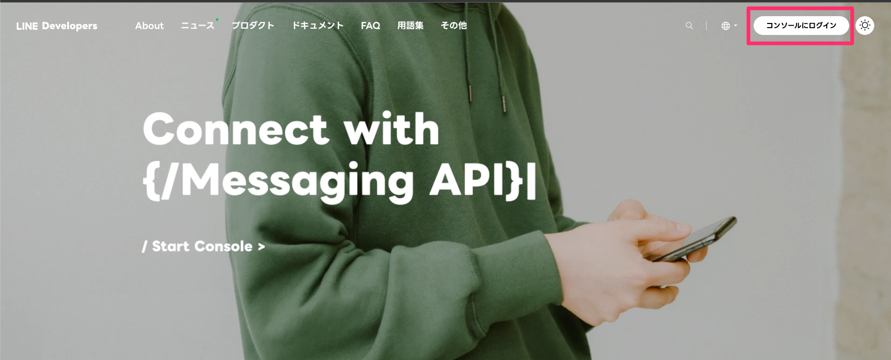
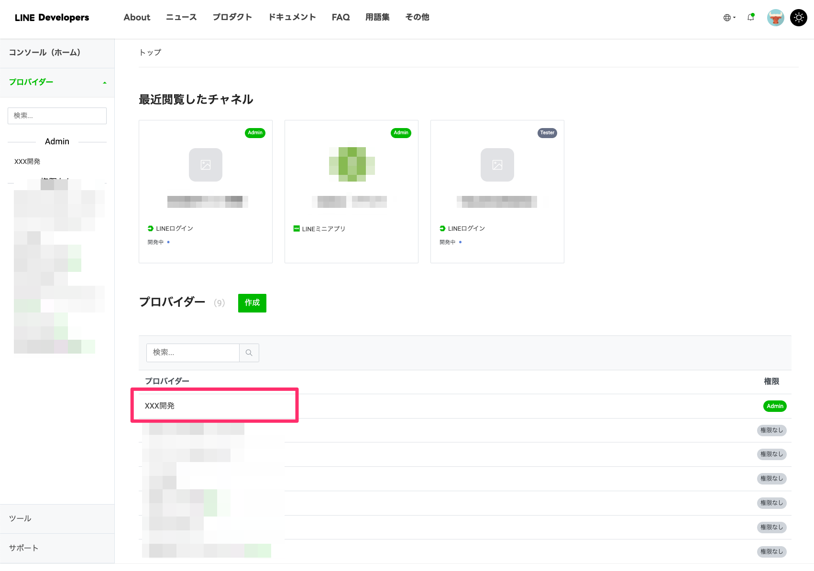
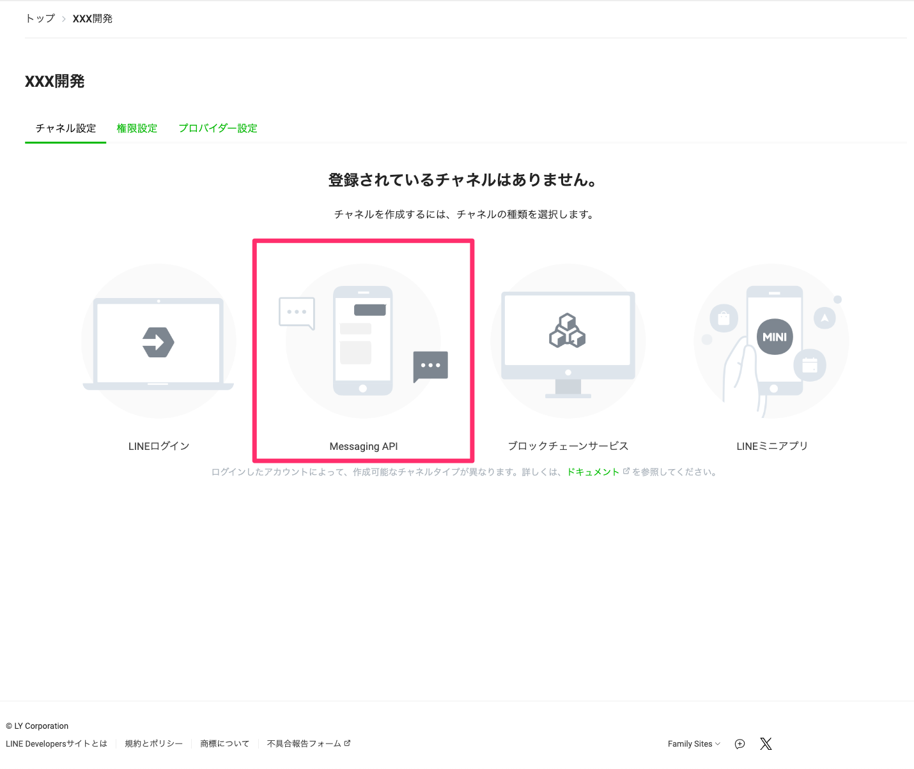
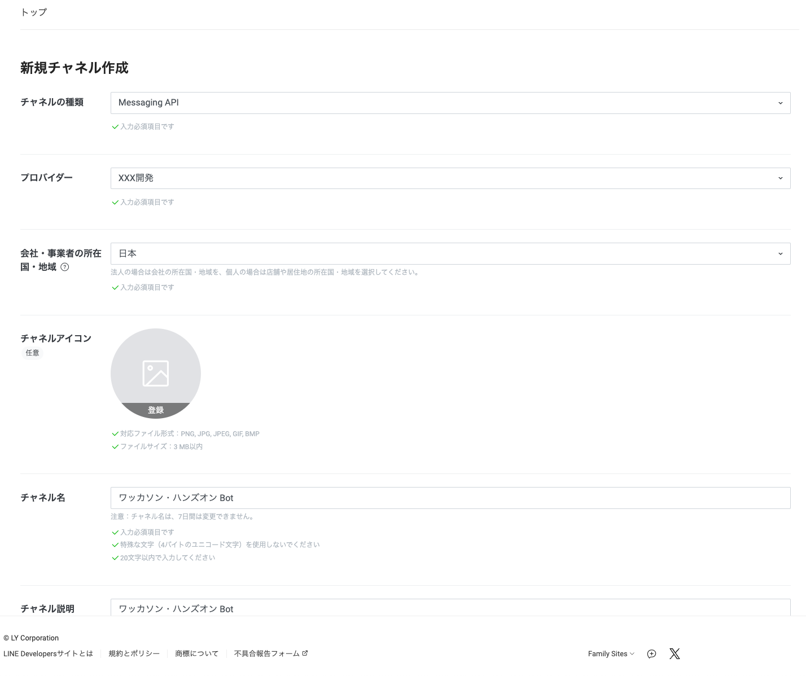
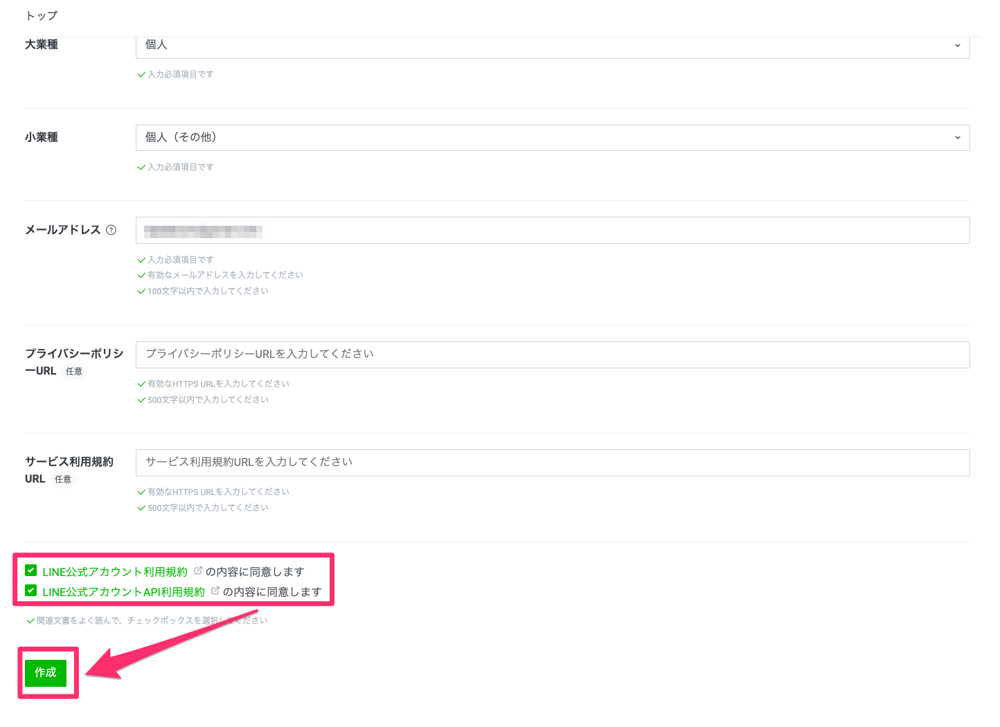
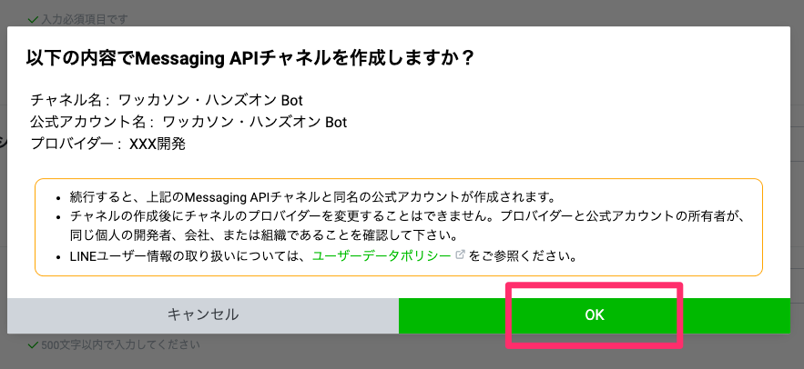
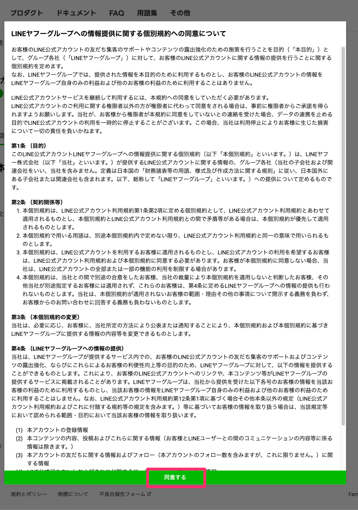
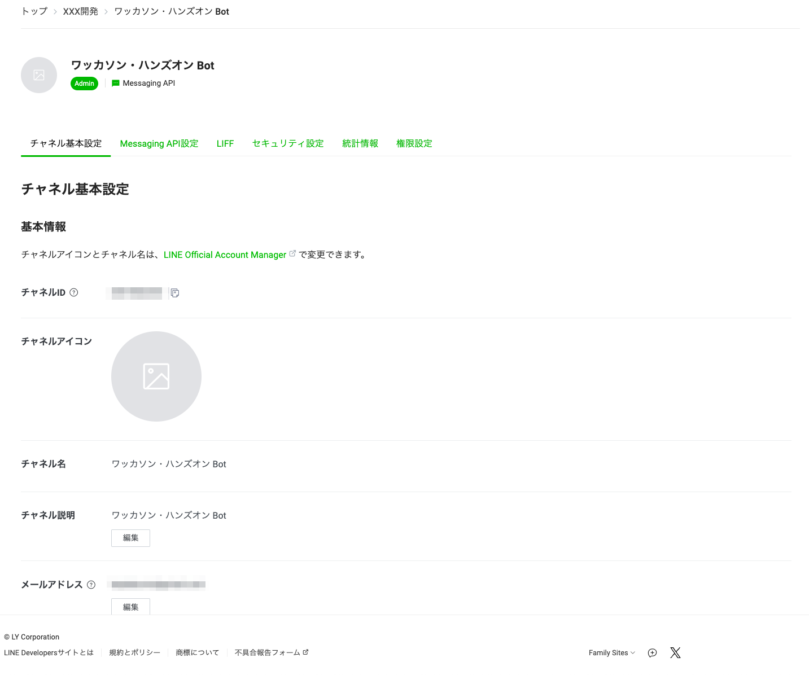
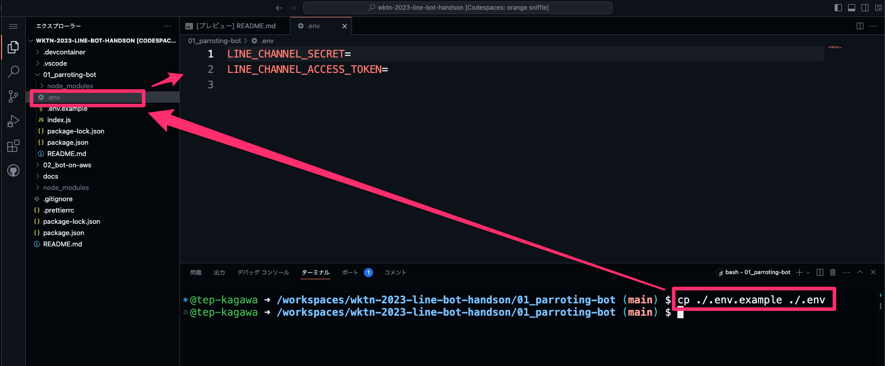
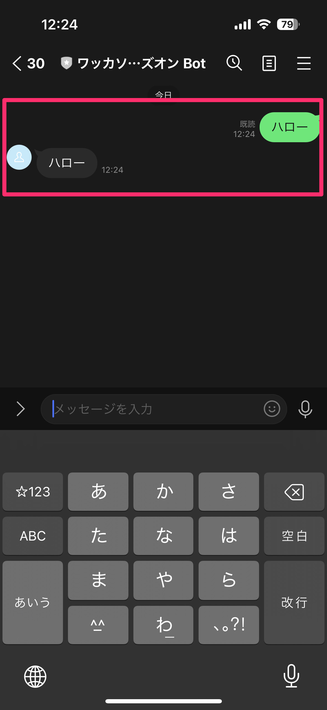

# オウム返し Bot

## 1. LINE Developers で Messaging API Channel を作成

LINE Platform で Bot を動かすために必要となる **チャネル** を作成します。

### 1-1. LINE Developers へログイン

Web ブラウザーで [LINE Developers](https://developers.line.biz/console/) にアクセスし、コンソールにログインしてください。



ログイン方法は、[LINE Bot の設定準備](../docs/PREPARE_LINE_BOT.md) を参照

### 1-2. Messaging API Channel を作成

事前準備で作成したプロバイダーを選択



`Messaging API` を選択



入力項目に下記の値を入力または選択



| 入力項目 | 値 |
| --- | --- |
| 会社・事業者の所在国・地域 | 日本 |
| チャネル名 | （任意：`ワッカソン・ハンズオン Bot` など） |
| チャネル説明 | （任意：`ワッカソン・ハンズオン Bot` など） |
| 大業種 | （任意：個人 など） |
| 小業種 | （任意：個人（その他） など） |
| メールアドレス | ご自身のメールアドレス（あらかじめ入力済み） |

規約同意のチェックを入れて `作成` を選択



`OK` を選択



`同意する` を選択



入力したチャネル情報が表示されれば、チャネルの作成が完了している



## 2. Messaging API Channel の設定を Bot に反映

### 2-1. 設定ファイルを作成

codespace のターミナルで下記コマンドを実行して、プログラムの設定ファイルを作成

```bash
cd 01_parroting-bot
cp ./.env.example ./.env
```

作成された `01_parroting-bot/.env` ファイルをエディターで開いてください。



### 2-2. チャネルシークレットを設定ファイルに記載

Messaging API チャネルの **チャネルシークレット** をコピーして設定ファイルに記載する。


### 2-3. チャネルアクセストークンの発行と設定ファイルに記載

`Messaging API設定` タブに切り替えて、**チャネルアクセストークン** を発行する。


**チャネルアクセストークン** をコピーして設定ファイルに記載する。


## 3. Bot アプリケーションを起動

### 3-1. アプリケーション起動

codespace のターミナルで下記コマンドを実行して、Bot アプリケーションを起動する。

```bash
npm run start
```

`Parroting bot app listening on port 3000` と表示され、シンプルブラウザーで `Hello World!` と表示されていば起動成功です。


### 3-2. codespace の Port forwarding を設定

LINE Platform から起動した Bot アプリケーションへアクセスできるよう、Port forwarding 設定を `Public` に変更します。

`ポート` タブを表示し、`Application (3000)` を選択して右クリック、`ポート表示範囲` -> `Public` を選択


### 3-3. アプリケーションの URL をコピーしてチャネル設定に反映

ポートレコードのコピーボタンを押して、アプリケーションの URL をコピー


チャネルの `Messaging API設定` にある `Webhook URL` に `{アプリケーションのURL}/webhook` を入力して、`更新` を選択


### 3-4. Webhook を有効化

`` をオンにして Webhook を有効化する。


### 3-5. 応答設定の変更

`応答メッセージ` の `編集` を選択して、応答設定画面を開く。


応答設定を下記のように変更する。


- チャット
    - オフ
- あいさつメッセージ
    - オフ
- Webhook
    - オン
- 応答メッセージ
    - オフ

## 4. LINE アプリからテキストメッセージを送信

### 4-1. 作成した Bot と友だちになる

チャネルの `Messaging API設定` に表示されている QR コードをスキャンして友だち追加します。


### 4-2. 動作確認

Bot のトーク画面からテキストメッセージを送って、そのまま返ってくるかを確認します。


